# Audit fonctionnel — Secret Clubhouse

Date : 23 juillet 2026  
Périmètre : application web React, API Express/PostgreSQL, PWA, clients Capacitor Android/iOS.  
Méthode : captures isolées dans Codex, lecture du code, build de production, contrôle syntaxique, audit npm et requêtes HTTP non destructives.

## Verdict

Le socle visuel est cohérent et plusieurs fondations sensibles sont bien engagées : authentification séparée, profils familiaux, autorisations par famille, identifiants opaques, conversations parent-enfant et parent-parent, masquage des flottes de Bataille navale et en-têtes HTTP de sécurité.

Le produit n’est toutefois pas prêt pour une mise en production destinée à des enfants. Les blocages principaux concernent le cycle d’approbation des contacts, les appels réels, l’application serveur des règles parentales, les notifications natives, les statuts de messages et la persistance des activités.

## Parcours capturés

Les écrans 1 à 4 utilisent l’entrée publique réelle. Les écrans authentifiés utilisent des réponses locales simulées uniquement pour rendre l’interface sans créer de compte ni modifier les données de production. Leur fonctionnement serveur est évalué séparément à partir du code.

1. **Connexion parent — plutôt sain.** Hiérarchie claire, séparation parent/enfant et message de confiance compréhensible. Le texte secondaire est très petit.

   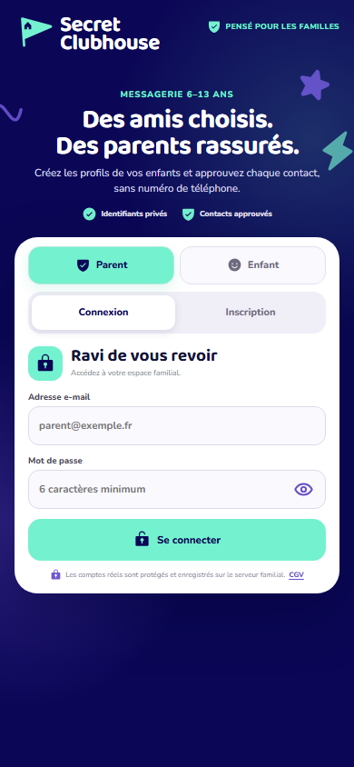

2. **Inscription parent — à corriger.** Le consentement parental est présent, mais le champ annonce « 6 caractères minimum » alors que la validation exige 8 caractères. Les mentions légales et la case à cocher sont peu lisibles.

   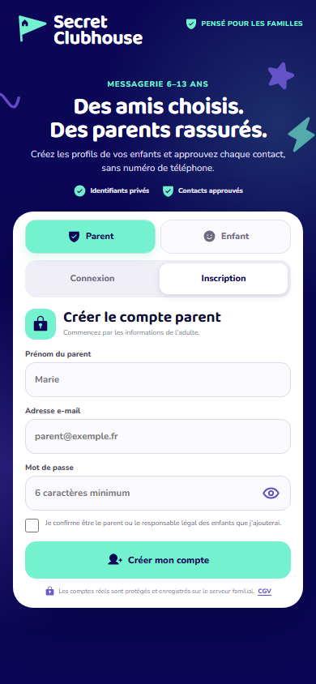

3. **Connexion enfant et erreur — plutôt sain, accessibilité à améliorer.** L’identifiant privé est central et aucun téléphone n’est demandé. Après une erreur, le focus reste sur le bouton au lieu d’aller au premier champ invalide.

   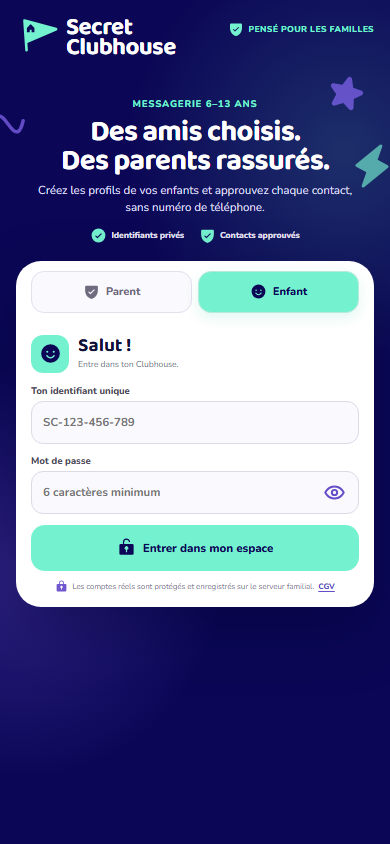

   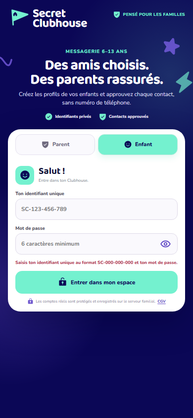

4. **Accueil parent — interface saine, données trompeuses.** L’espace est clair et respecte la confidentialité des messages, mais les compteurs d’amis/demandes et « Aucun signalement » sont codés en dur.

   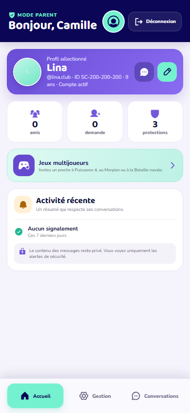

5. **Gestion familiale — interface solide, fonction contact incomplète.** Les profils, co-parents, identifiants, mot de passe et réglages sont bien regroupés. La liste de demandes affiche toujours un état vide et aucun contrôle d’acceptation/refus n’existe.

   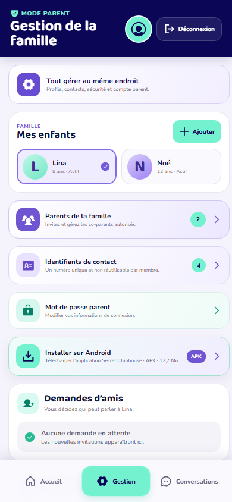

   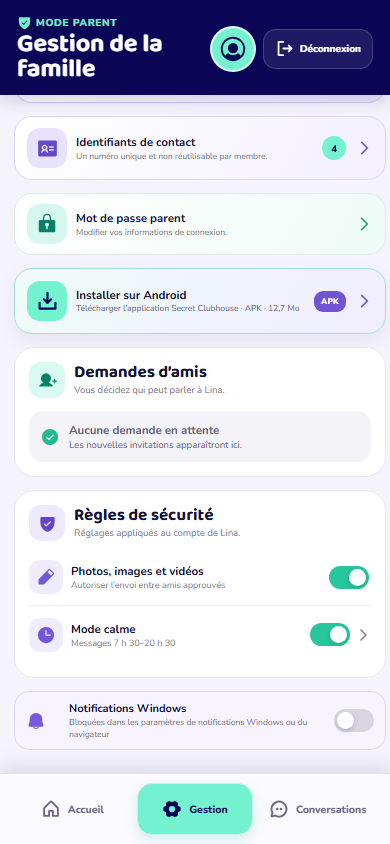

6. **Messagerie parentale — bonne séparation, appels manquants.** Les conversations avec enfants et co-parent sont correctement étiquetées. L’ajout de contact est réduit à une icône et les appels audio/vidéo ne sont pas proposés dans les conversations parentales.

   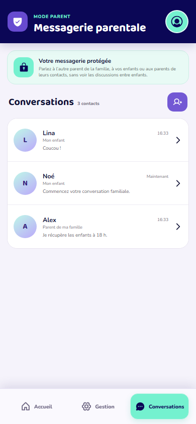

   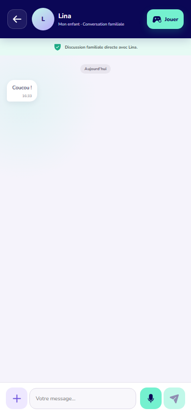

7. **Accueil enfant — attrayant, petit défaut de reflow.** Les contacts approuvés et conversations sont lisibles. À 390 px, la phrase d’accueil est rognée par l’action QR.

   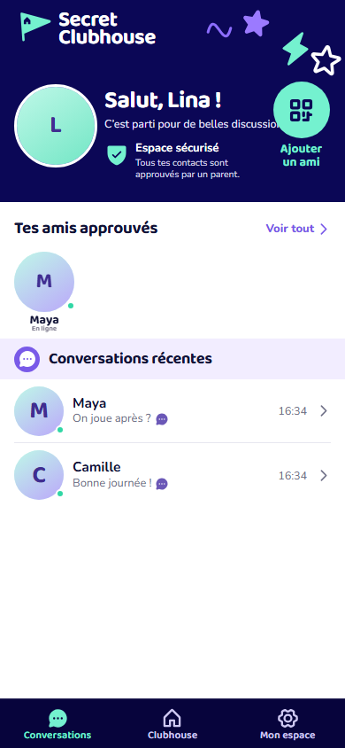

8. **Ajout d’ami et QR — bonne interface, backend bloquant.** L’entrée d’identifiant vient avant le QR et le passage par le parent est explicite. Le QR encode seulement l’URL et l’identifiant opaque. Le serveur ne permet cependant pas de terminer l’approbation.

   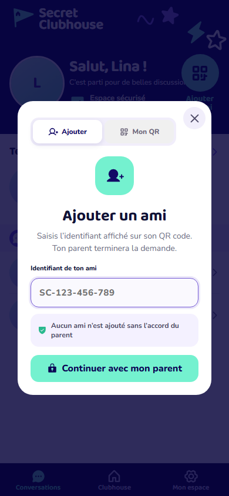

   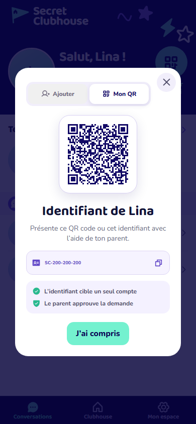

9. **Profil enfant — sain.** La colonne reste cohérente et l’écran peut défiler sur un téléphone de 320 × 568 pour rendre la déconnexion entièrement accessible au-dessus de la navigation.

   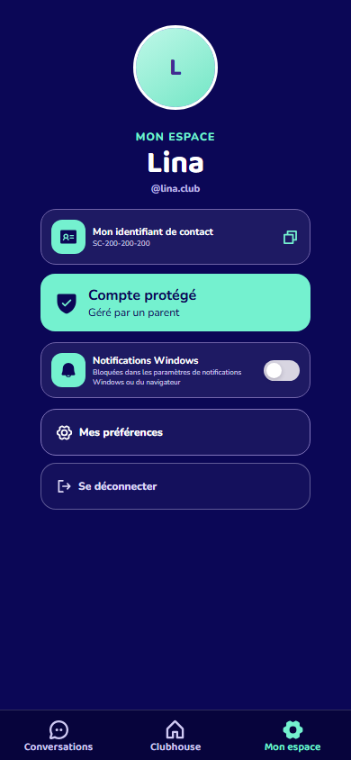

   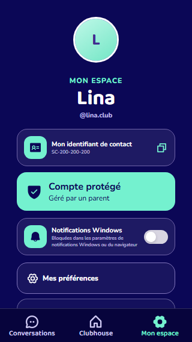

   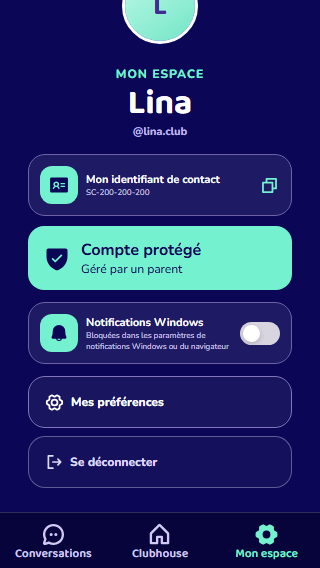

10. **Clubhouse — visuellement abouti, progression non persistante.** Les filtres, cartes et récompenses sont clairs. Les 120 étoiles et la série de 3 jours sont fictives et toute progression disparaît lorsque le composant est recréé.

    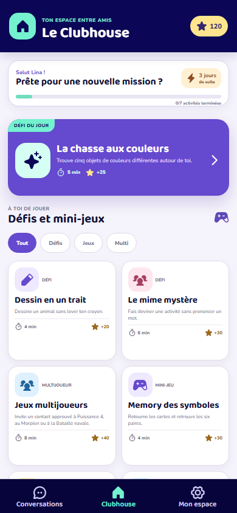

## Problèmes prioritaires

### Bloquants

1. **Le cycle d’approbation des contacts n’existe pas.** L’API sait seulement créer une demande. Il n’existe aucun endpoint pour lister, accepter ou refuser les demandes, ni de table de contacts approuvés ou de création de conversation externe. L’interface parent affiche toujours « Aucune demande en attente ». La demande est en plus liée au parent demandeur, pas au profil enfant concerné.

2. **Les appels audio/vidéo sont une simulation locale.** Le client crée deux `RTCPeerConnection` dans le même navigateur et génère un faux flux distant. Il n’existe ni signalisation serveur, ni STUN/TURN, ni invitation d’appel, ni état entrant/refusé/annulé. Les appels entre deux appareils et les appels parentaux ne peuvent donc pas fonctionner.

3. **Les règles parentales sont contournables.** Les horaires, l’autorisation média et la mise en pause sont contrôlés uniquement dans React. Les endpoints de messages et médias vérifient l’appartenance à la conversation, mais pas l’horaire, le réglage média ou le statut du compte enfant. La réponse automatique est seulement dessinée dans le chat ; elle n’est ni persistée ni envoyée.

4. **Les notifications natives et l’expérience d’appel verrouillé ne sont pas implémentées.** Les jetons APNs/FCM sont stockés mais jamais utilisés pour envoyer une notification. Il n’y a aucun CallKit, ConnectionService/Telecom, canal Android ou catégorie iOS. Android ne déclare que `INTERNET`; iOS ne contient ni descriptions caméra/micro ni entitlement push.

5. **Les statuts reçu/vu sont simulés.** La base ne stocke aucun accusé de réception ou de lecture. Le client marque tout comme reçu puis fait parfois passer localement le message à « vu » avec un minuteur. Les compteurs non lus ne peuvent pas être fiables.

### Élevés

6. **Progression et activité parent fictives.** Étoiles, série quotidienne, activités terminées, récompense unique, compteurs parentaux et « Aucun signalement » vivent seulement dans l’état local ou sont codés en dur. Aucun schéma PostgreSQL ne les persiste.

7. **Risque de déni de service sur les médias.** `multer@2.0.2` est touché par plusieurs avis élevés. Le serveur garde en mémoire jusqu’à 6 fichiers de 25 Mo, soit 150 Mo par requête, sur un service Render pouvant disposer de 256 Mo. Aucun quota familial ou utilisateur n’est appliqué.

8. **Dépendances vulnérables.** `npm audit` signale 1 vulnérabilité critique et 3 élevées : `tar` via Capacitor CLI, `multer`, Vite et Capacitor CLI. Vite et `tar` affectent surtout la chaîne de build, tandis que Multer est directement exposé par l’API.

9. **Paquet natif non prêt.** Le téléchargement public sert `Secret-Clubhouse-debug.apk`, plus ancien que le code courant. Android autorise les sauvegardes de l’application. Le `Package.swift` iOS contient un chemin Windows avec antislashs susceptible de ne pas compiler sur macOS.

10. **Protection anti-bruteforce absente.** Les connexions parent et enfant ne sont pas limitées par IP, compte ou fenêtre temporelle. Le JWT dure 7 jours et est conservé dans `localStorage`, ce qui augmente l’impact d’un script injecté.

11. **Présence trop largement consultable.** Tout compte authentifié peut demander l’état en ligne de jusqu’à 100 identifiants valides, sans vérifier qu’ils appartiennent à sa famille ou à ses contacts.

12. **Cadre légal incomplet.** Les CGV se déclarent provisoires, l’identité de l’éditeur manque et aucune politique de confidentialité finalisée n’est accessible avant l’inscription. C’est un risque de lancement important pour un service traitant des données d’enfants.

### Moyens

13. **Performance mobile.** Le build passe, mais le chunk Phaser pèse environ 1,48 Mo minifié et le bundle principal environ 520 Ko. Toutes les variantes linguistiques des polices sont incluses, y compris cyrillique, vietnamien et devanagari.

14. **Accessibilité.** Plusieurs modales n’installent pas de piège de focus ni de retour de focus. Les onglets ne gèrent pas les flèches clavier. Certaines mentions sont très petites et peu contrastées. Les erreurs ne déplacent pas le focus vers le champ concerné.

15. **Maintenabilité et régressions.** `App.jsx`, `styles.css` et `server/index.js` concentrent l’essentiel du produit dans de très gros fichiers. Aucun test applicatif n’est présent et aucun script de test n’existe.

16. **Erreurs serveur trop bavardes.** Le gestionnaire renvoie `error.message` même pour une erreur interne, ce qui peut révéler des informations PostgreSQL ou d’implémentation.

## Points solides

- Build de production réussi et endpoint de santé production opérationnel.
- Mots de passe hachés avec bcrypt, JWT expirant, CSP et en-têtes HTTP défensifs.
- Séparation parent/enfant, contrôle familial des créations/modifications/suppressions et suppression enfant réservée au parent principal.
- Invitations co-parent liées à l’e-mail, hachées, expirantes et à usage unique.
- Conversations parent-enfant et parent-parent automatiquement provisionnées.
- Bataille navale sérialisée sans révéler les navires adverses non touchés.
- QR contenant uniquement une URL et l’identifiant opaque.
- Médias protégés par l’appartenance à la conversation.

## Ordre de correction recommandé

1. Construire le modèle de contacts approuvés et son cycle demande → acceptation/refus → conversation.
2. Faire appliquer par l’API le statut enfant, les horaires, les médias et les réponses automatiques.
3. Remplacer les simulations d’appel, de réception/lecture et de progression par des états serveur.
4. Finaliser APNs/FCM, CallKit/Telecom et les permissions natives.
5. Corriger les vulnérabilités, limiter les uploads, ajouter rate limiting, quotas et tests d’autorisation.
6. Finaliser le cadre légal puis optimiser les bundles et l’accessibilité.

## Limites

- Aucun compte réel n’a été créé et aucune donnée de production n’a été modifiée.
- Les écrans authentifiés ont été rendus avec des données locales simulées ; ils valident l’interface, pas le backend.
- Les appels, notifications verrouillées et permissions nécessitent encore des tests sur de vrais appareils iOS et Android après implémentation.
- Le code a été modifié dans le workspace pendant l’audit ; les captures représentent l’état observé entre 16 h 31 et 16 h 44, tandis que le build final a été relancé après les dernières modifications détectées.
